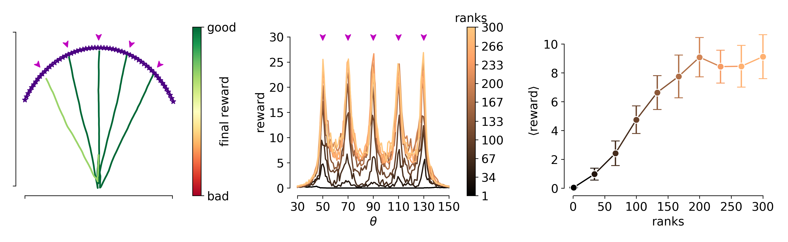

# Behavioral cloning in recurrent spiking networks: A comprehensive framework
This repository is the official implementation of *Behavioral cloning in recurrent spiking networks: A comprehensive framework*.

## Button & Food Task
This section of the repository is dedicated to the `Button & Food` task. The core result of the analysis is reported in *Figure 4* of the paper (see below), which highlights how higher ranks in the feedback matrix `B` obtain superior performances.



### Requirements

The code is written in `Python 3` and requires the following external dependences to run:

```
pickle
matplotlib
numpy
os
tqdm
```

Each package can be installed through `pip` (or anaconda) by running:

> pip3 install <name_of_package>

#### 2. Training-Evaluation code

The training and the evaluation of the model are performed at the same time. A period of training is alternated to a period of test. The experimental parameters are contained in the configuration file `config.json`. To modify the training epochs, the learning rates etc... it is sufficient to replace the appropriate keyword (refer to the paper for the meaning of the parameters).

In order to reproduce the data presented in Fig.4B-D run:

> python3 button_food.py

#### 3. Visualization code

To plot the results presented in Fig.4B-D run:

> python3 figure_4.py

This can be done also without running the previous step, the results are pre-saved in a `pickle` dictionaries format under the `data/` folder.
